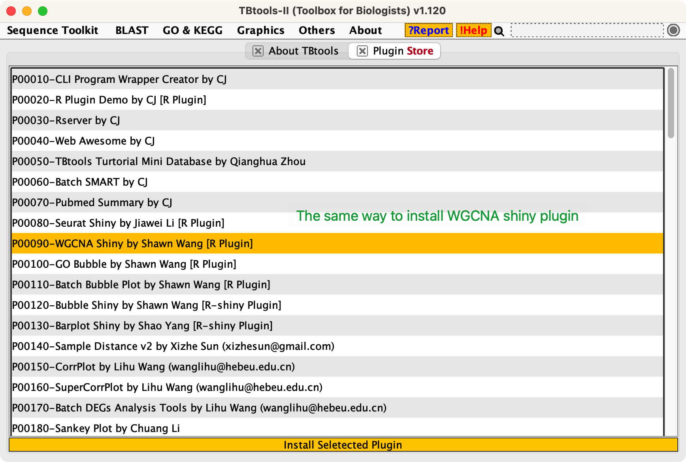

# WGCNA-shinyApp

[](https://www.r-project.org) [](https://www.yuque.com/cjchen/hirv8i/fzc4g9)  [](https://opensource.org/licenses/MIT) [](http://www.shawnlearnbioinfo.top/)

A shiny app for WGCNA...

# Getting started

------------------------------------------------------------------------

R version: `>4.1.1`

OS: `MacOS > 10.10`, `Win 7-11`, `linux must have a graphic interface`

## started with R or Rstudio

``` bash
# clone this repo to your machine
git clone git@github.com:ShawnWx2019/WGCNA-shinyApp.git WGCNAshiny

cd WGCNAshiny

## Method 1.

Rscript WGCNAbyClick.v1.R

## Method 2. open WGCNAbyClick.v1.R by Rstudio or other IDE you perfer and run this script.
```


## Started with TBtools plugin 

You can get TBtools from [CJ-Chen/TBtools](https://github.com/CJ-Chen/TBtools)  

**If you've utilized TBtools for your analysis, please cite:**

Chen C, Chen H, Zhang Y, Thomas HR, Frank MH, He Y, Xia R. TBtools: An Integrative Toolkit Developed for Interactive Analyses of Big Biological Data. Mol Plant. 2020 Aug 3;13(8):1194-1202. doi: [10.1016/j.molp.2020.06.009](https://doi.org/10.1016/j.molp.2020.06.009). 


Follow the following steps to install `RServer.plugin` and `WGCNA shiny.plugin`




# Input data prepare

------------------------------------------------------------------------

## Expression matrix

You can prepare your datExpr file following the [Expression matrix flie](Demo/WGCNA_fpkm_data.txt)

**Data source:**

-   transcriptomics

    -   readcount.

    -   expected count

    -   normalized readcount (FPKM, RPKM, TPM, CPM)

    -   microarray data

-   metabolomics

    -   peak area.

-   proteomics,

    -   protein abundance.

    -   corrected intensity

-   ...

**Format:**

-   Gene/metabolite/protein ID in row and sample ID in column.

-   The sample ID should not contain spaces (), special symbols (`- @ * & #`) etc., and should not start with numbers.

-   DO NOT use pure numbers as gene/metabolite/protein ID.

-   Only accepted tab-delimited file, such as `.txt` or `.tsv`, DO NOT use `.csv`, `.xlsx`, `.xls`.

## Trait table.

You can prepare your trait file following the [trait data file](Demo/WGCNA_data_trait.txt) The data can be quantitative traits or qualitative traits.

**For qualitative:**

*format1.*

| sample_id | type    |
|-----------|---------|
| S_0001    | treat   |
| S_0002    | treat   |
| S_0003    | treat   |
| S_0004    | control |
| S_0005    | control |
| S_0006    | control |

if the input trait data have only 2 columns, the format1 will be automaticly transformed to format2.

*format2.*

| sample_id | treat | control |
|-----------|-------|---------|
| S_0001    | 1     | 0       |
| S_0002    | 1     | 0       |
| S_0003    | 1     | 0       |
| S_0004    | 0     | 1       |
| S_0005    | 0     | 1       |
| S_0006    | 0     | 1       |

**For quantitative:**

| sample_id | plant_height | yield |
|-----------|--------------|-------|
| S_0001    | 12           | 1920  |
| S_0002    | 14           | 1930  |
| S_0003    | 13           | 1919  |
| S_0004    | 20           | 3020  |
| S_0005    | 25           | 3021  |
| S_0006    | 22           | 3320  |

# Step by step analysis

------------------------------------------------------------------------

## Step1. Expression matrix filtering

According to the [WGCNA FAQ](https://horvath.genetics.ucla.edu/html/CoexpressionNetwork/Rpackages/WGCNA/faq.html), the expression data we input needs to undergo data cleaning before it can be used for WGCNA analysis. We have processed the data as follows:

1.  For read count values in RNAseq data, we need to normalize them using the `vst` function from `DESeq2`. For already normalized count values, such as FPKM, RPKM, TPM values, etc., we can use the original values, or transform them using log10(x+1).  

> "We then recommend a variance-stabilizing transformation. For example, package DESeq2 implements the function varianceStabilizingTransformation which we have found useful, but one could also start with normalized counts (or RPKM/FPKM data) and log-transform them using log2(x+1). For highly expressed features, the differences between full variance stabilization and a simple log transformation are small."

2.  For noise removal, a specific explanation can be referred to:  

> "We suggest removing features whose counts are consistently low (for example, removing all features that have a count of less than say 10 in more than 90% of the samples) because such low-expressed features tend to reflect noise and correlations based on counts that are mostly zero aren't really meaningful. The actual thresholds should be based on experimental design, sequencing depth and sample counts."

3.  Filter the top N genes with the greatest variation through median absolute deviation (MAD) or based on variance (VAR) for subsequent analysis.  

> "Probesets or genes may be filtered by mean expression or variance (or their robust analogs such as median and median absolute deviation, MAD) since low-expressed or non-varying genes usually represent noise. Whether it is better to filter by mean expression or variance is a matter of debate; both have advantages and disadvantages, but more importantly, they tend to filter out similar sets of genes since mean and variance are usually related."

**Parameters:**

`Format`:

-   `count`, integer, read count from RNAseq data\
-   `expected count`, float, expected count generated by `RSEM`,\
-   `normalized count`, float, normalized expression levels, such as FPKM, RPKM, or TPM\
-   `peak area`, float, peak area of metabolites produced by LC-MS. Typically, we perform data cleaning and normalization on the peak area in the analysis results.\
-   `protein abundance`, the results from software like PD might be protein abundance, while MaxQuant might provide corrected intensity. Both can be used. However, when the input is corrected intensity, the values are less than 1. In this case, be mindful of the threshold selection in subsequent filtering.

`Normalized method`

- `raw` use the raw value.  

- `logarithm` use log10(x+1)

- `Sample percentage` 0-1, In **what** percentage of samples does the expression level fall below the cutoff

- `Expression Cutoff` numeric, In what percentage of samples does the expression level fall below **the cutoff**

`Filter Method`  

- `MAD` median absolute deviation

- `SVR` variance

`Reserved genes Num` integer, How many genes would you like to retain for WGCNA analysis after the filtering process? Please note, if this number surpasses the count of genes remaining after filtering, all the filtered genes will be preserved.

**Step by step**


## Step2. selection and validation of the soft-threshold

In the construction of a weighted co-expression network, we need to select an appropriate soft-thresholding value to build a scale-free network. The criteria for judging whether the soft-thresholding value is appropriate generally consider that the closer the mean connectivity is to 0 and the signed R^2 is to 1 under this power value, the closer the network is to a scale-free network. However, the power should not be too large, as a larger power value may lead to a higher false positive rate. Therefore, we usually choose the power value that first crosses the R2 threshold line and has a mean connectivity closest to 0 under this power value as the soft-thresholding value for subsequent analysis.

**Parameters:**

`R^2 cutoff` numeric, cutoff of scale-free topology model fit.

`Power type` If the recommended power value provided by the software is suitable, select 'recommend'. If it is found to be unsuitable, choose an appropriate threshold based on the two graphs on the right, then change this option to 'customized', and select the threshold you want to use in 'final power selection'.

**Step by step**


## Step3. One step network construction and module detection.

**Steps for scale-free network construction**：  

Similarity Matrix Construction: Calculate the correlation between all genes, usually using the Pearson correlation coefficient. This results in a similarity matrix.

Weighted Similarity Matrix: Transform the similarity matrix into a weighted similarity matrix. This is achieved by raising each element in the similarity matrix to a positive power β (β>1). The choice of β is to make the network satisfy scale-free distribution.

Topological Overlap Matrix: Calculate the topological overlap between genes, which reflects how similar the neighbors of two genes are. The purpose of this step is to reduce noise and sparsity.

Gene Module Detection: Use hierarchical clustering methods to cluster the genes in the topological overlap matrix into different modules. These modules are a set of highly co-expressed genes.

**Parameters:**

`min Module Size` The minimum number of genes to form a module implies that if there are not enough genes, they cannot be divided into a module.

`module cuttree height` Refers to the threshold set on the hierarchical clustering dendrogram, which determines the partitioning of genes into distinct modules.

`select max blocksize` When calculating correlations, if you input tens of thousands of genes, the calculation requires a large amount of memory. If there is insufficient memory, the calculation will be terminated. At this point, you need to divide the genes into different blocks, calculate separately, divide the modules, and finally merge the modules. Of course, our suggestion is to put as many genes as possible into one block. The table below shows the theoretical relationship between memory size and max block size.

memory|block size
---|---
8G | 5000-10000
16G | 10000-20000
32G | 20000-30000
64G | 30000-40000

**step by step**

  


## Step4. Module-trait relationship.  

After dividing genes into different modules, based on the experimental design, we need to see if these modules are associated with the traits we are testing, or with sample classification information. This step can reveal and explore the connection between modules and biological issues, and is an important part of WGCNA analysis.  

Additionally, we provide a simple method for purifying modules. Inspired by [Emily et.al](https://www.biorxiv.org/content/10.1101/234062v1) , we also aim to achieve better co-expression network analysis results through iterative WGCNA. However, we did not adopt their method. We simply gradually remove genes with low kME and those that cannot be classified, resulting in a more purified module division.  

To facilitate the reproduction of previous data analysis processes, or to conduct further analysis in R, we have saved the variables prior to module construction.  

**Parameters:**  

「NOTICE」For iterative WGCNA, Method 1 is not work for now, please use method 2.  

`KME cutoff` numeric, Remove genes with the kME cutoff of each module.  

`Choose method`,  
    method 1: not work now  
    method 2: recommanded.

**step by step**  

  
  
  
  

## Step5. Interested module and hubgene.  

After obtaining the modules of interest through module-trait, we want to see the specific relationship between the module and the traits. In subsequent steps, we can calculate the correlation between genes within the module and the phenotype to get Gene Significance (GS), and calculate the correlation between the gene and the module eigengene to get Module Membership (MM). A higher MM indicates that the gene is in a hub position in the co-expression network constructed by the module, and a high GS indicates that the gene's expression pattern is highly correlated with the phenotype, and is likely to affect the formation of the trait. In this way, we have found the key genes controlling the phenotype and the gene co-expression network driven by them.

If your analysis does not include trait data, you can select the genes with the highest kME values in each module as hubgenes based on the previous kME table. Alternatively, you can group the materials according to the materials, and then try the following steps. However, when determining whether it is a hubgene, you only need to consider MM, not GS, after all, your biological significance is not mainly about sample classification, and the significant relationship between the module and sample classification is not your focus. Your focus should be on the function of each module and the core of the co-expression network. This experimental design suggests that after the module division is completed, perform enrichment analysis for each module, find the module related to the biological issue you are concerned about, and then find the hubgenes of the module via only MM (kME).


**parameters**

`cutoff of absoulute value of kME`  Generally, it is required to be above 0.8. If it's too low, the module division may not be appropriate.  

`cutoff of absoulute value of GS`  Generally, it is required to be above 0.5.   

`weight threshold` Generally, it is required to be above 0.02. If the module is large and there are many edge results, the visualization can be quite messy, so you can appropriately increase the weight threshold.  

**Step by Step**  

  
  
  
  


# Update

------------------------------------------------------------------------

<font color=red>**Jan 21 2023**</font> <font color=green>**V0.0.6.230121**</font>

-   🍿 + New options of input data format.

-   🍿 + Ceil expected count.

-   🍬 + Progress bar in module detection and module-trait step.

-   🐛 + Modified some inappropriate descriptions.

-   ⭐️ + Outlier remove.

-   ⭐️ + IterativeWGCNA.

-   🍀 + Export parameter.
