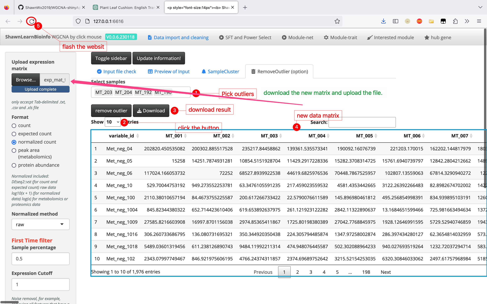

# WGCNA-shinyApp

[](https://www.r-project.org) [](https://www.yuque.com/cjchen/hirv8i/fzc4g9)  [](https://opensource.org/licenses/MIT) [](http://www.shawnlearnbioinfo.top/)

A shiny app for WGCNA...

# Getting started

------------------------------------------------------------------------

R version: `>4.1.1`

OS: `MacOS > 10.10`, `Win 7-11`, `linux must have a graphic interface`

``` bash
# clone this repo to your machine
git clone git@github.com:ShawnWx2019/WGCNA-shinyApp.git WGCNAshiny

cd WGCNAshiny

## Method 1.

Rscript WGCNAbyClick.v1.R

## Method 2. open WGCNAbyClick.v1.R by Rstudio or other IDE you perfer and run this script.
```


## Method 3. TBtools plugin | WGCNA shiny 

You can get TBtools from [CJ-Chen/TBtools](https://github.com/CJ-Chen/TBtools)  

If you've utilized TBtools for your analysis, please cite:

Chen C, Chen H, Zhang Y, Thomas HR, Frank MH, He Y, Xia R. TBtools: An Integrative Toolkit Developed for Interactive Analyses of Big Biological Data. Mol Plant. 2020 Aug 3;13(8):1194-1202. doi: [10.1016/j.molp.2020.06.009](https://doi.org/10.1016/j.molp.2020.06.009). 

Follow the following steps to install `RServer.plugin` and `WGCNA shiny.plugin`


# Input data prepare

------------------------------------------------------------------------

## Expression matrix

You can prepare your datExpr file following the [Expression matrix flie](Demo/WGCNA_fpkm_data.txt)

**Data source:**

-   transcriptomics

    -   readcount.

    -   expected count

    -   normalized readcount (FPKM, RPKM, TPM, CPM)

    -   microarray data

-   metabolomics

    -   peak area.

-   proteomics,

    -   protein abundance.

    -   corrected intensity

-   ...

**Format:**

-   Gene/metabolite/protein ID in row and sample ID in column.

-   The sample ID should not contain spaces (), special symbols (`- @ * & #`) etc., and should not start with numbers.

-   DO NOT use pure numbers as gene/metabolite/protein ID.

-   Only accepted tab-delimited file, such as `.txt` or `.tsv`, DO NOT use `.csv`, `.xlsx`, `.xls`.

## Trait table.

You can prepare your trait file following the [trait data file](Demo/WGCNA_data_trait.txt) The data can be quantitative traits or qualitative traits.

**For qualitative:**

*format1.*

| sample_id | type    |
|-----------|---------|
| S_0001    | treat   |
| S_0002    | treat   |
| S_0003    | treat   |
| S_0004    | control |
| S_0005    | control |
| S_0006    | control |

if the input trait data have only 2 columns, the format1 will be automaticly transformed to format2.

*format2.*

| sample_id | treat | control |
|-----------|-------|---------|
| S_0001    | 1     | 0       |
| S_0002    | 1     | 0       |
| S_0003    | 1     | 0       |
| S_0004    | 0     | 1       |
| S_0005    | 0     | 1       |
| S_0006    | 0     | 1       |

**For quantitative:**

| sample_id | plant_height | yield |
|-----------|--------------|-------|
| S_0001    | 12           | 1920  |
| S_0002    | 14           | 1930  |
| S_0003    | 13           | 1919  |
| S_0004    | 20           | 3020  |
| S_0005    | 25           | 3021  |
| S_0006    | 22           | 3320  |

# Step by step analysis

------------------------------------------------------------------------

## Step1. Expression matrix filtering

According to the [WGCNA FAQ](https://horvath.genetics.ucla.edu/html/CoexpressionNetwork/Rpackages/WGCNA/faq.html), the expression data we input needs to undergo data cleaning before it can be used for WGCNA analysis. We have processed the data as follows:

1.  For read count values in RNAseq data, we need to normalize them using the `vst` function from `DESeq2`. For already normalized count values, such as FPKM, RPKM, TPM values, etc., we can use the original values, or transform them using log10(x+1).  

> "We then recommend a variance-stabilizing transformation. For example, package DESeq2 implements the function varianceStabilizingTransformation which we have found useful, but one could also start with normalized counts (or RPKM/FPKM data) and log-transform them using log2(x+1). For highly expressed features, the differences between full variance stabilization and a simple log transformation are small."

2.  For noise removal, a specific explanation can be referred to:  

> "We suggest removing features whose counts are consistently low (for example, removing all features that have a count of less than say 10 in more than 90% of the samples) because such low-expressed features tend to reflect noise and correlations based on counts that are mostly zero aren't really meaningful. The actual thresholds should be based on experimental design, sequencing depth and sample counts."

3.  Filter the top N genes with the greatest variation through median absolute deviation (MAD) or based on variance (VAR) for subsequent analysis.  

> "Probesets or genes may be filtered by mean expression or variance (or their robust analogs such as median and median absolute deviation, MAD) since low-expressed or non-varying genes usually represent noise. Whether it is better to filter by mean expression or variance is a matter of debate; both have advantages and disadvantages, but more importantly, they tend to filter out similar sets of genes since mean and variance are usually related."

**Parameters:**

`Format`:

-   `count`, integer, read count from RNAseq data\
-   `expected count`, float, expected count generated by `RSEM`,\
-   `normalized count`, float, normalized expression levels, such as FPKM, RPKM, or TPM\
-   `peak area`, float, peak area of metabolites produced by LC-MS. Typically, we perform data cleaning and normalization on the peak area in the analysis results.\
-   `protein abundance`, the results from software like PD might be protein abundance, while MaxQuant might provide corrected intensity. Both can be used. However, when the input is corrected intensity, the values are less than 1. In this case, be mindful of the threshold selection in subsequent filtering.

`Normalized method`

- `raw` use the raw value.  

- `logarithm` use log10(x+1)

- `Sample percentage` 0-1, In **what** percentage of samples does the expression level fall below the cutoff

- `Expression Cutoff` numeric, In what percentage of samples does the expression level fall below **the cutoff**

`Filter Method`  

- `MAD` median absolute deviation

- `SVR` variance

`Reserved genes Num` integer, How many genes would you like to retain for WGCNA analysis after the filtering process? Please note, if this number surpasses the count of genes remaining after filtering, all the filtered genes will be preserved.




## Step2. Expression matrix filtering


# Update

------------------------------------------------------------------------

<font color=red>**Jan 21 2023**</font> <font color=green>**V0.0.6.230121**</font>

-   🍿 + New options of input data format.

-   🍿 + Ceil expected count.

-   🍬 + Progress bar in module detection and module-trait step.

-   🐛 + Modified some inappropriate descriptions.

-   ⭐️ + Outlier remove.

-   ⭐️ + IterativeWGCNA.

-   🍀 + Export parameter.
